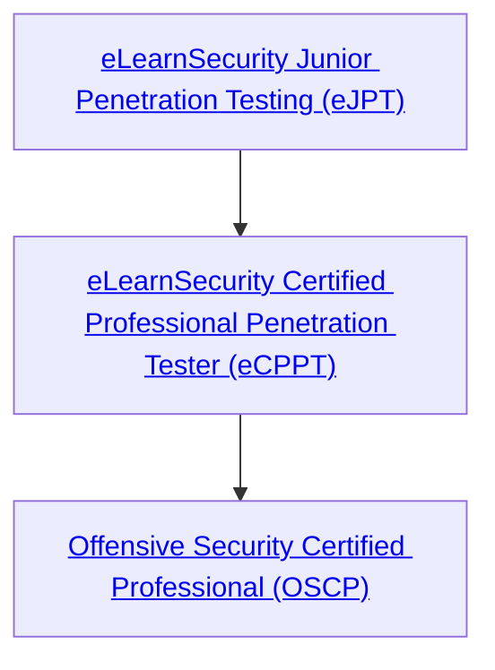

# My eJPT Journey
I am using this repository to document my learnings as I undertake preparation for the [eLearnSecurity Junior Penetration Tester (eJPT)](https://elearnsecurity.com/product/ejpt-certification/) certification. 

## Content
I am tracking my learning progress in the following two places:
- [Topics](/docs/topics/topics.md)
- [Labs](/docs/labs/labs.md)

The Topics area covers my notes from the course content.  It also contains additional notes from supplemental resources.  

The Labs area covers my experience and learnings as I work through each of the labs.

# About the eJPT
Training for the eJPT is provided by [INE](https://ine.com), of which [eLearnSecurity](https://elearnsecurity.com/) is a subsidiary. INE stands for InternetNetwork Expert.

The eJPT certification is the first of three certifications I intend to achieve to expand my knowledge in pentesting and offensive security operations:

I discovered this certification track from the good folks at Reddit from this thread [here](https://www.reddit.com/r/Pentesting/comments/dq7rxn/oscp_vs_gpen_and_gxpen/?utm_source=share&utm_medium=ios_app&utm_name=iossmf). 

Here is a helpful link to a map of numerous security certifications, showing where the eJPT falls into play: [Security Certification Roadmap](https://pauljerimy.com/security-certification-roadmap/). 

