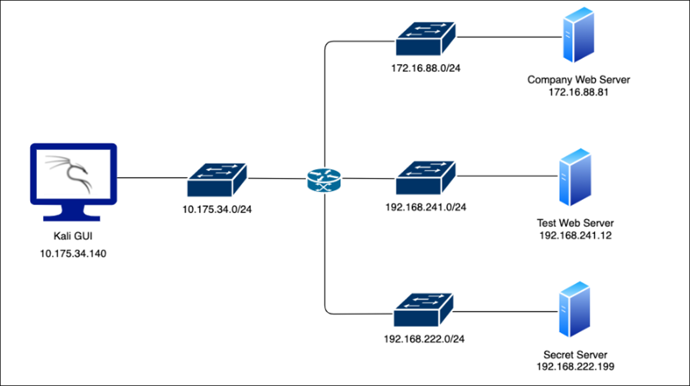
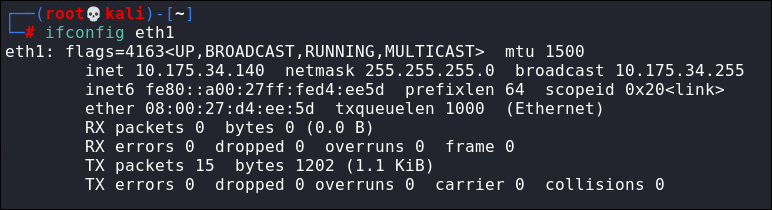
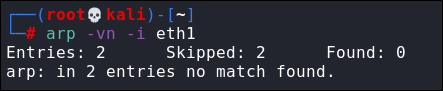
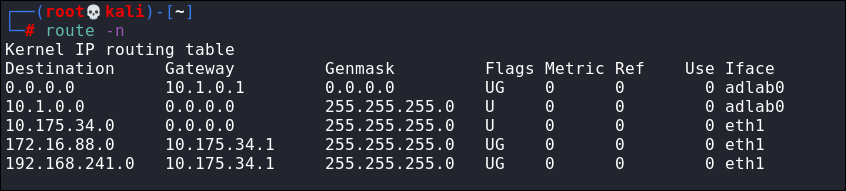

# Lab 1: Find the Secret Server
The first lab is an introduction to routing. In this lab you are given access to a Kali Linux instance. The Kali instance is connected to the 10.175.34.0/24 network.  There are more networks, in each network, there is a web server with the following IP addresses: 172.16.88.81, 192.168.241.12, and 192.168.222.199.

**Objective**: Configure the routes on the Kali instance to reach all the hosts in the networks!

**Instructions**
- Use **eth1** interface of Kali instance for accessing other hosts in the networks
- Do not attack the gateway machines located at IP addresses 10.175.88.1, 172.16.88.1, and 192.168.222.1

**Tools**
- Web browser

## Exploration

| Notes | Screenshot |
| - | - |
| Run `ifconfig eth1` - Note IP address for eth1 interface  - **ifconfig** doesn't list the default gateway | |
| No entries in arp table for **eth1** |  |
| Run `route -n` to show routing table - The IP address for the gateway is 10.175.34.1 - Under flags: &emsp;U: route is up &emsp;G: gateway - See [here](https://www.cyberciti.biz/faq/how-to-find-out-default-gateway-in-ubuntu/) for more info | 
