# Lab 2: Data Exfiltration

In this lab, you use data exfiltration techniques to capture data in a restricted environment.

## Lab Environment
You have exploited a vulnerable API endpoint and overwritten it with malicious code. This modification allows you to run commands on the server machine hosting the API, as a low-privileged user, i.e. student. A sensitive flag file is kept in a zipped archive file in the student's home directory.

Also, there is a monitor process running on the server machine that blocks most protocols except HTTP.

**Objective:** Transfer the zipped archive to your Kali machine using HTTP protocol and retrieve the flag!

**Instructions:**  
- The API endpoint is accessible at **demo.ine.local** domain

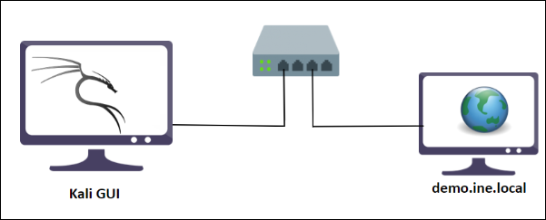

**Tools:**
- Nmap
- Web browser
- Python scripting
- curl

## Exploration

Run Nmap to determine open connections. The `-A` switch turns on *Advanced* and *Aggressive* features such as OS detection and service detection. Note that port 8000/tcp is open.

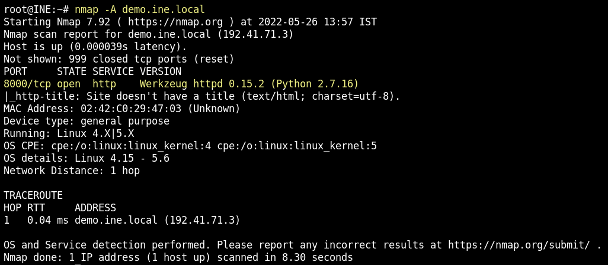

Viewing this service through a browser, you get a message indicating **cmd parameter required**.

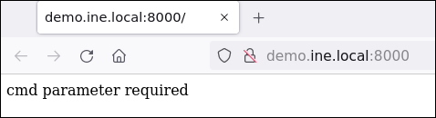

You get the same result using the `curl` command:

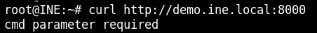

At this point, I had to glance back at the solution, as I had no idea how to pass the **cmd** parameter. As it turns out, you can pass **cmd** parameter with the URL in the form of `http://url/?cmd=`. This is a very common style used with web shells. When you pass the `cmd` parameter by using the `ls` command, you see the payload **flag.zip**.

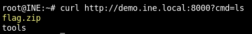

The next task is to figure out how I to pass arguments to the `ls` command. Knowing that **%20** is the equivalent of a space in a URL, you can use additional arguments with `ls`:

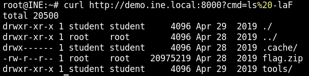

After peaking back at the solution, I discovered you can use **+** in place of **%20**:

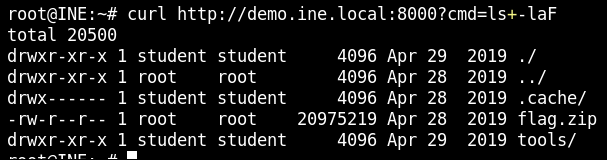

## Side Track - Exfil.py
The tools folder contains an interesting Python script, called **exfil.py**. 

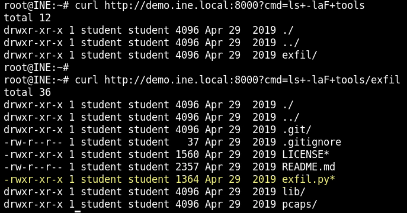

By noting the presence of the **.git** folder, you determine this tool is associated with a Git repository. You can use the **cat** command to view the contents of the Git config file:

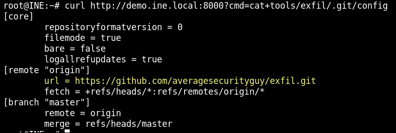

The Git config file indicates that documentation for **exfil.py** is available here: https://github.com/averagesecurityguy/exfil

By viewing the README file, you learn that **exfil.py** can be used to pass data via covert channels, such as through ICMP and DNS Lookup. This tool relies on creating a client-server connection and includes a number of dependent modules and packages:

- Dependent Packages
  - dnslib
  - dpkt

- Dependent Modules
  - dns_lookup
  - ping_data

In turn, each of these modules and packages have a number of dependencies, most of which are not available on the host.

You can use a combination of the **cat** command and the redirection operator to copy the modules to the host, but you'll eventually run into a permissions error when trying to copy the **dpkt.py** module, as it is located in a secure folder, `/usr/local/lib/python2.7`, for which the remote shell does not have access. And given that the host machine does not have an internet connection to install the package, this route ended up becoming a dead in for my case.

However, I feel this tool is valuable, so I'm documenting it here for future reference.

## Exploration Continued
Getting back on track, the goal is to download the payload **flag.zip** to your host machine.  

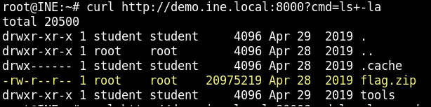

You can't **curl** command from the host because you're restricted with using the **cmd** parameter through the API. So you need to figure out a way to leverage the API to download the file.

I was completely stumped here and had to refer back to the solution. The solution advises to (1) create a web server on the host using a Python script and (2) use the **curl** command through the remote shell to upload the file to the host. Here's how this works...

Verify the existence of the **curl** command on the host:

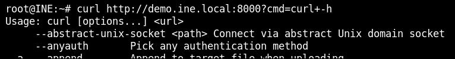

On the host, drop into a Python session and enter `help()`; then type `modules`:

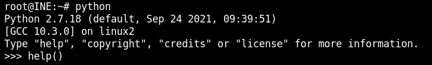

Note the presence of the [**BaseHTTPServer**](https://docs.python.org/2/library/basehttpserver.html) and [**SimpleHTTPServer**](https://docs.python.org/2/library/simplehttpserver.html) modules:

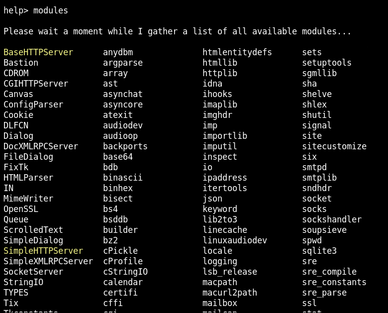

The solution references the following script that you can use to create a web server on the host and upload a file from the target: [SimpleHTTPPutServer.py](https://gist.github.com/fabiand/5628006). 

```
# python -m SimpleHTTPPutServer 8080
import SimpleHTTPServer
import BaseHTTPServer

class SputHTTPRequestHandler(SimpleHTTPServer.SimpleHTTPRequestHandler):
    def do_PUT(self):
        print self.headers
        length = int(self.headers["Content-Length"])
        path = self.translate_path(self.path)
        with open(path, "wb") as dst:
            dst.write(self.rfile.read(length))


if __name__ == '__main__':
    SimpleHTTPServer.test(HandlerClass=SputHTTPRequestHandler)
```
Here's a deep dive into the script: 

- You run the script by specifying the module name and a port number, e.g. `python -m SimpleHTTPPutServer.py 8080`. The script listens for packets on all network interfaces, so you do not need to specify an IP address.

- The class `SputHTTPRequestHandler` derives from [`SimpleHTTPServer.SimpleHTTPRequestHandler`](https://docs.python.org/2/library/simplehttpserver.html#SimpleHTTPServer.SimpleHTTPRequestHandler). 

- The class `SimpleHTTPServer.SimpleHTTPRequestHandler` derives from [`BaseHTTPServer.BaseHTTPRequestHandler`](https://docs.python.org/2/library/basehttpserver.html#BaseHTTPServer.BaseHTTPRequestHandler).

- The class `BaseHTTPServer.BaseHTTPRequestHandler` by itself does not process any actual HTTP requests. It must be subclassed to handle each request method.  The subclass `SimpleHTTPServer.SimpleHTTPRequestHandler` only defines the `do_HEAD()` and `do_GET()` methods; it does not define the `do_PUT()` method. This is why the script defines `do_PUT()` method.

- The class `BaseHTTPServer.BaseHTTPRequestHandler` parses the HTTP request and calls a method specific to the request type. So if you send the request `SPAM` instead of `GET`, the `do_SPAM()` method will be called.

- The class `BaseHTTPServer.BaseHTTPRequestHandler` defines the inherited attributes, `self.headers` and `self.path`, which are used in the script. `self.path` represents the request path, not the local path.

- The [`Content-Length`](https://www.w3.org/Protocols/rfc2616/rfc2616-sec14.html) entity-header field indicates the transfer length of the message body, in decimal number of OCTECTS. This value is used to read the file from a byte stream for writing to local disk.

- The method `self.translate_path()` is not mentioned in the documentation but is viewable in the source code [here](https://github.com/python/cpython/blob/2.7/Lib/SimpleHTTPServer.py). This method translates the request path to the local filename syntax, removing any query parameters.

- The Python built-in function [`open()`](https://docs.python.org/3/library/functions.html#open) opens a file and returns a corresponding file object. In this case, the usage of the function is in the form of `open(file, mode)`, where `file` is a [path-like object](https://docs.python.org/3/glossary.html#term-path-like-object) and `mode` specifies the mode in which the file is opened, in this case `wb` used in `open(path, wb)` stands for open for **w**riting and **b**inary mode.

- The method `self.rfile()` derives from the `BaseHTTPServer.BaseHTTPRequestHandler` class and processes the file's input stream.

- The method `SimpleHTTPServer.test()` creates the web server, assigning the first optional argument as a port number. The Python documentation doesn't mention this method, but you can view the source code [here](https://github.com/python/cpython/blob/2.7/Lib/SimpleHTTPServer.py). The source code specifies the address as `server_address = ('', port)`. From the [socket documentation](https://docs.python.org/3/library/socket.html), the network interface name `''` indicates to receive packets from all network interfaces. 


Once you have the script on the server, you'll need to make the script executable by running `chmod 744 server.py`. 

Then run the Python command `python server.py 80` to load up the web server.

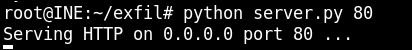

The idea now is to use the `curl` command on the target to upload the `flag.zip` file. 

From the target, you need to know the IP address of the host. On the host, run the command `ip a | grep inet` to get this information. Note the host machine has multiple IP addresses.

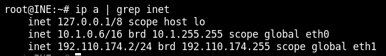

Use `traceroute` to confirm the IP address from which the target machine communicates.

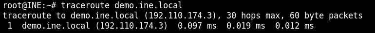

Then use the `curl` command with the `--upload-file` option to upload `flag.zip` to the host.


The server responds with an accept message.

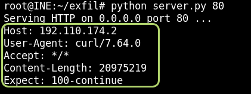

Confirm that `flag.zip` now exists on the host.

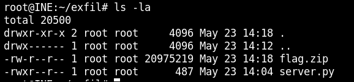

Unzip the file.

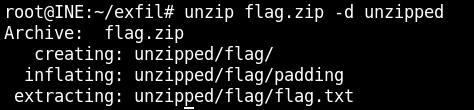

Finally, retrieve the flag!

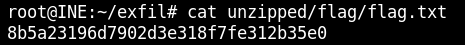

## Summary
I really enjoyed this lab. In fact, I would go so far as to say that this is THE lab that confirmed my interest in offensive security techniques.  I learned a lot of useful tricks that I had not seen before, including query strings and leveraging remote shell operations. I also took some time to drill in deep into the Python source code, which furthered my level of understanding on how Python works. I spent over 10 hours on this lab and feel that I came away with a lot more knowledge. 