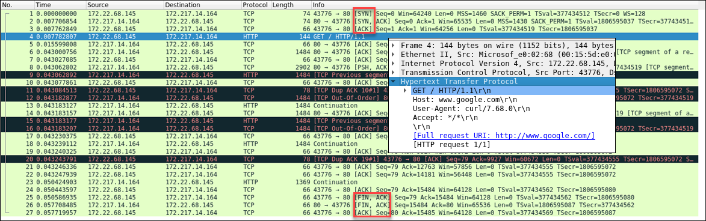
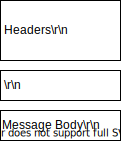
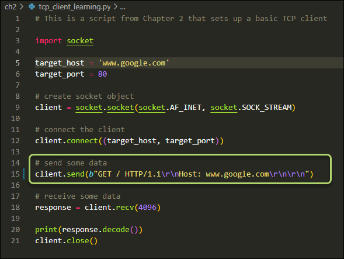
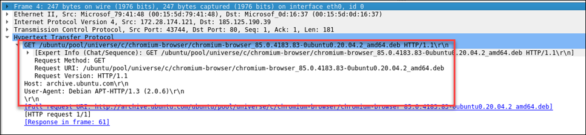
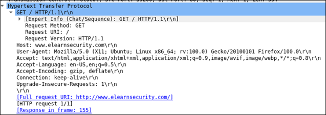

# 1. Web Applications
- To understand web application security, you need to know some web application fundamental aspects:
  - HTTP Protocol Basics
  - Cookies
  - Sessions
  - Same Origin Policy

# 1.1 HTTP Protocol Basics
HTTP works on top of the TCP protocol. A TCP connection is first established, and then the client sends its request and waits for the answer. The server processing the request sends back its answer, providing a status code and appropriate data.  

  
Reference: https://hpbn.co/http1x/

Here's an example of a wireshark trace to www.google.com, showing the initial TCP connection, followed by the HTTP request:  

The general format of an HTTP message is:

&emsp;

To end new lines in HTTP, you have to use the `\r` (carriage return) and the `\n` (newline) characters. 

Here is an example of how you can use a python script to send and HTTP request:

## 1.2 HTTP Requests
HTTP requests consist of a verb, e.g. GET, followed by a path, and the protocol version, e.g. HTTP/1.1.  The path tells the server which resource the browser is asking for. The protocol version tells the server how to communicate with the browser.

Here's an example of a wireshark capture when running the command `apt install chromium-browser`:

There are many HTTP methods, like
- PUT
- TRACE
- HEAD
- POST

The book [HTTP: The Definitive Guide](https://www.amazon.com/dp/B0043D2EKO/?coliid=I39XHW1A67262P&colid=3QCUW0AS9534O&psc=0&ref_=lv_ov_lig_dp_it) is a highly-recommended resource for learning the basics of HTTP.

Here is another Wireshark capture of visiting www.elearnsecurity.com with the Firefox browser:

The **Host** header field specifies the Internet hostname and port number of the resource being requested. A web server can host multiple websites.  This header field tells the server which site the client is asking for.

The host value is obtained from the [URI](https://www.w3.org/TR/uri-clarification/) of the resource, in the case above the URI is www.elearnsecurity.com.

The **User Agent** header field tells the server what client software is issuing the request. It may also reveal to the server the operating system version.

The browser sends the **Accept** header field to specify which document type it is expecting in the response. Similarly, with **Accept-Language**, the browser can ask for a specific (human) language in the response.

**Accept-Encoding** works similarly to **Accept** but restricts the content encoding, not the content itself.  In this case, the browser accepts two types of compression, gzip and deflate.

The **Connection** header field allows the sender to specify options that are desired for that particular connection. In this case, future connections with the server will reuse the current connection.  
