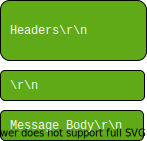

# 1. Web Applications
- To understand web application security, you need to know some web application fundamental aspects:
  - HTTP Protocol Basics
  - Cookies
  - Sessions
  - Same Origin Policy

# 1.1 HTTP Protocol Basics
HTTP works on top of the TCP protocol. A TCP connection is first established, and then the client sends its request and waits for the answer. The server processing the request sends back its answer, providing a status code and appropriate data.  

  
Reference: https://hpbn.co/http1x/

Here's an example of a wireshark trace to www.google.com, showing the initial TCP connection, followed by the HTTP request:  

The general format of an HTTP message is:

&emsp;
