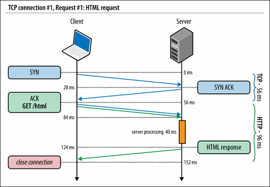
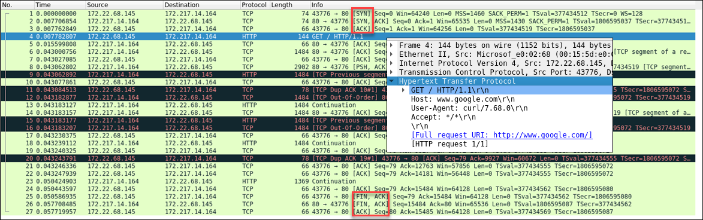
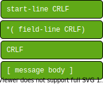
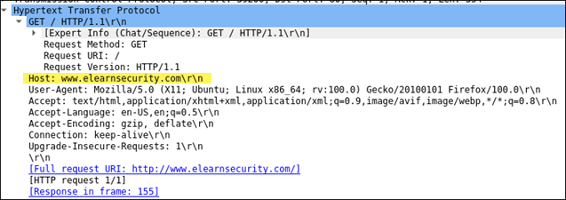
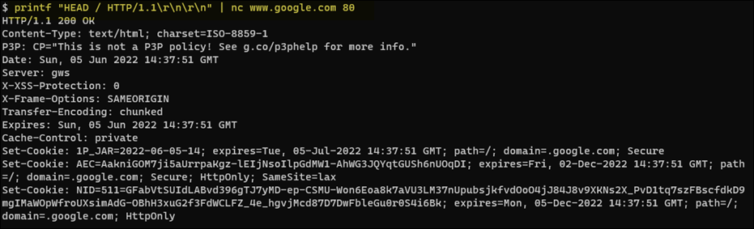

# 1. HTTP Protocol
To understand web application security, you need to know some web application fundamental aspects:
  - [HTTP Protocol Basics](#11-http-protocol-basics)
  - Cookies
  - Sessions
  - Same Origin Policy

### References
- [HTTP: The Definitive Guide](https://www.amazon.com/dp/B0043D2EKO/?coliid=I39XHW1A67262P&colid=3QCUW0AS9534O&psc=0&ref_=lv_ov_lig_dp_it) - a highly-recommended resource for learning the basics of HTTP. 
- [RFC 9112 - HTTP/1.1](https://www.rfc-editor.org/rfc/rfc9112.html) - Message format, request line, status line, field syntax, message body
- [RFC 9110 - HTTP Semantics](https://www.rfc-editor.org/rfc/rfc9110.html) - URI schemes, fields, methods, authentication, status codes
- [RFC 3986 - URI Generic Syntax](https://www.rfc-editor.org/rfc/rfc3986.html) - describes difference between URI, URL, and URN

# 1.1 HTTP Protocol Basics
HTTP works on top of the TCP protocol. A TCP connection is first established, and then the client sends its request and waits for the answer. The server processing the request sends back its answer, providing a status code and appropriate data. 

  
Reference: https://hpbn.co/http1x/

Here's an example of a wireshark trace to www.google.com, showing the initial TCP connection, followed by the HTTP request:  


All HTTP messages fall into two types: *request messages* and *response messages*. The general format of an HTTP message as defined by [RFC9112](https://www.rfc-editor.org/rfc/rfc9112.html) is:

&emsp;

`CRLF` stands for carriage return line feed and is the Internet standard for a newline. A CRLF is typically issued as `\r` (carriage return) and `\n` (newline) in code. 

The start-line for an HTTP request looks like:
```xml
<method> <request-URL> <version>
```
Here's a quick description on each component:
- `<method>` corresponds to the action the client wants the server to perform on the resource, e.g. GET, PUT, POST. 
- `<request-URL>` refers to the location of the resource on the server. 
- `<version>` is in the form `HTTP/<major>.<minor>`, e.g. 'HTTP/1.1'

Here is an example of how you can use a python script to send an HTTP request:


The start-line comprises the code `GET / HTTP/1.1\r\n`. The field-line comprises `Host: www.google.com\r\n`.  The last requisite `\r\n` exists between the field-line and the message body, and since GET requests do not have a message body, this is there the HTTP message ends.

You can also use `netcat` to issue an HTTP request:

```
printf "GET / HTTP/1.1\r\n\r\n" | nc www.google.com 80
```
In this case, there exists the requisite `\r\n` after the start line and then the requisite `\r\n` before the message body.  Again, the message body is not defined for the GET method.

## 1.2 HTTP Requests
HTTP requests consist of a verb, e.g. GET, followed by a path, and the protocol version, e.g. HTTP/1.1.  The path tells the server which resource the browser is asking for. The protocol version tells the server how to communicate with the browser.

Here's an example of a Wireshark capture when running the command `apt install chromium-browser`:


There are many HTTP methods, like
- HEAD - send just the HTTP headers from the response for the named resource
- PUT - writes documents to a server in the inverse way that GET reads documents from a server
- POST - send client data to a server, i.e. form data for processing by a gateway server
- DELETE - remove a document from the server
- TRACE - trace the message through proxy servers to the server
- OPTIONS - determine what methods can operate on the server

Here is another Wireshark capture from visiting www.elearnsecurity.com with the Firefox browser:



The **Host** header field specifies the Internet hostname and port number of the resource being requested. A web server can host multiple websites.  This header field tells the server which site the client is asking for. The host value is obtained from the [URI](https://www.w3.org/TR/uri-clarification/) of the resource, in the case above the URI is www.elearnsecurity.com.

The **User Agent** header field tells the server what client software is issuing the request. It may also reveal to the server the operating system version.

The browser sends the **Accept** header field to specify which document type it is expecting in the response. Similarly, with **Accept-Language**, the browser can ask for a specific (human) language in the response.

**Accept-Encoding** works similarly to **Accept** but restricts the content encoding, not the content itself.  In this case, the browser accepts two types of compression, gzip and deflate.

The **Connection** header field allows the sender to specify options that are desired for that particular connection. In this case, future connections with the server will reuse the current connection.  

You can use `netcat` and the `HEAD` method to view only the headers:


